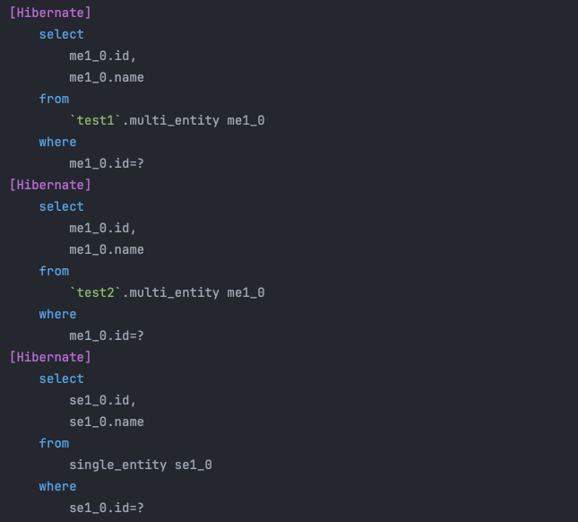

# JPA Dynamic Schema

## 📖 개요

- JPA에서 런타임 시 동적으로 스키마를 변경할 수 있는 예제

---

## 🛠️ 기술 스택

- Kotlin 1.9.25
- Spring Boot 3.3.5
- MariaDB 11.5.2

---

## 💾 DDL

```sql
CREATE SCHEMA `test1`;
CREATE SCHEMA `test2`;

USE test1;
create table multi_entity
(
    id   int auto_increment
        primary key,
    name varchar(255) not null
);

create table single_entity
(
    id   int auto_increment
        primary key,
    name varchar(255) not null
);

USE test2;
create table multi_entity
(
    id   int auto_increment
        primary key,
    name varchar(255) not null
);
```

---

## ⭐️주요 코드 설명

### CustomStatementInspector

```kotlin
class CustomStatementInspector : StatementInspector {
    override fun inspect(sql: String?): String {
        return sql!!.replace(SCHEMA_NAME_PLACEHOLDER, DBUtils.getSchemaName())
    }
}
```

- JPA에서 실행되는 SQL을 가로채서 동적으로 스키마 이름을 변경하는 역할을 합니다.
- Entity 생성 시 `@Table(catalog = "SCHEMA_NAME_PLACEHOLDER")` 과 같이 구분자를 사용하여 등록 후, `SCHEMA_NAME_PLACEHOLDER`를 찾아서 동적으로
  변경합니다.
- `DBUtils.getSchemaName()` 메서드를 통해 Request에 저장된 스키마 이름을 가져옵니다.

### HibernateConfig

```kotlin
@Configuration
class HibernateConfig {

    @Bean
    fun hibernatePropertiesCustomizer(): HibernatePropertiesCustomizer {
        return HibernatePropertiesCustomizer { properties: MutableMap<String?, Any?> ->
            properties[AvailableSettings.STATEMENT_INSPECTOR] = CustomStatementInspector()
        }
    }
}
```

- Hibernate 설정을 커스터마이징하기 위한 클래스입니다.
- `STATEMENT_INSPECTOR`를 `CustomStatementInspector`로 설정합니다.

---

## 🎥 결과

```kotlin
@Test
fun test() {
    // test1 스키마에 있는 데이터
    DBUtils.setSchemaName("test1")
    val test1Result = multiEntityRepository.findById(1).get()
    assert(test1Result.name == "test1 스키마")

    // test2 스키마에 있는 데이터
    DBUtils.setSchemaName("test2")
    val test2Result = multiEntityRepository.findById(1).get()
    assert(test2Result.name == "test2 스키마")

    // default 스키마에 있는 데이터
    val singleSchemaResult = singleEntityRepository.findById(1).get()
    assert(singleSchemaResult.name == "test1 스키마")
}
```

